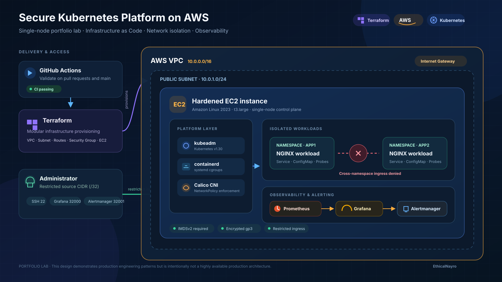

# Secure Kubernetes Platform on AWS

[](https://github.com/EthicalNayro/secure-kubernetes-platform-aws/actions/workflows/validate.yml)

An end-to-end, production-style Kubernetes platform lab deployed on AWS. The project provisions the cloud infrastructure with Terraform, bootstraps Kubernetes with `kubeadm`, enforces workload isolation with Calico NetworkPolicies, and adds monitoring and alerting with the `kube-prometheus-stack` Helm chart.

> This repository intentionally uses a single-node cluster for a reproducible portfolio lab. It demonstrates production engineering patterns, but it is not a highly available production architecture.

## Architecture



The diagram shows the complete lab flow: GitHub Actions validation, modular Terraform provisioning, restricted administrative access, the single-node Kubernetes platform, Calico-enforced namespace isolation, and the Prometheus-to-Alertmanager observability path.

## What this project demonstrates

- Modular AWS infrastructure provisioning with Terraform
- Restricted administrative and monitoring access using an administrator `/32` CIDR
- EC2 hardening with encrypted `gp3` storage and IMDSv2 enforcement
- Automated Kubernetes and containerd installation on Amazon Linux 2023
- Calico-based namespace isolation using Kubernetes NetworkPolicies
- Resource requests, limits, readiness probes, ConfigMaps, Services, and ServiceAccounts
- Cluster observability with Prometheus, Grafana, Alertmanager, and a custom CPU alert
- Automated repository validation with GitHub Actions

## Repository structure

| Phase | Directory | Purpose |
| --- | --- | --- |
| 01 | `part1-terraform-infrastructure` | Provision the VPC, subnet, routing, Security Group, and EC2 node |
| 02 | `part2-bootstrap` | Install containerd and bootstrap the Kubernetes control plane |
| 03 | `part3-networking` | Deploy workloads and enforce cross-namespace isolation |
| 04 | `part4-observability` | Deploy Prometheus, Grafana, Alertmanager, and custom alerts |

## Quick start

### 1. Provision AWS infrastructure

```bash
cd part1-terraform-infrastructure
cp terraform.tfvars.example terraform.tfvars
# Edit terraform.tfvars with your administrator CIDR and existing EC2 key-pair name.

terraform init
terraform fmt -check -recursive
terraform validate
terraform plan
terraform apply
```

### 2. Bootstrap Kubernetes

Copy `part2-bootstrap/bootstrap-k8s.sh` to the EC2 node and run:

```bash
sudo chmod +x bootstrap-k8s.sh
sudo ./bootstrap-k8s.sh
```

### 3. Apply workload isolation

```bash
kubectl apply -f part3-networking/app1.yaml
kubectl apply -f part3-networking/app2.yaml
```

### 4. Deploy observability

```bash
helm repo add prometheus-community https://prometheus-community.github.io/helm-charts
helm repo update
helm upgrade --install kube-prometheus-stack prometheus-community/kube-prometheus-stack \
  --namespace monitoring \
  --create-namespace \
  --values part4-observability/values.yaml
```

## Security design

- SSH, Grafana, and Alertmanager are reachable only from the administrator CIDR configured in Terraform.
- No credentials, account-specific IAM dependencies, Terraform state, or environment-specific values are committed.
- NetworkPolicies allow same-namespace ingress while blocking cross-namespace ingress by default.
- EC2 Instance Metadata Service requires IMDSv2 tokens.
- The root EBS volume is encrypted and deleted with the instance.

## Validation

The workflow in `.github/workflows/validate.yml` checks:

- Terraform formatting and validation
- Shell syntax and ShellCheck results for the bootstrap script
- YAML syntax for Kubernetes and Helm values files

Runtime evidence is documented alongside the relevant deployment and verification steps in [Part 4: Observability and Alerting](part4-observability/README.md).

### Monitoring and alerting evidence


## Production considerations

A production deployment should use a managed or multi-node control plane, private subnets, load balancers or an ingress layer, managed state storage, centralized secrets management, backups, and multi-AZ worker capacity.

## Cleanup

```bash
helm uninstall kube-prometheus-stack --namespace monitoring
kubectl delete -f part3-networking/app1.yaml
kubectl delete -f part3-networking/app2.yaml

cd part1-terraform-infrastructure
terraform destroy
```
