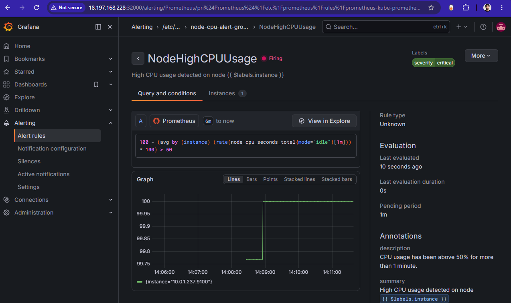
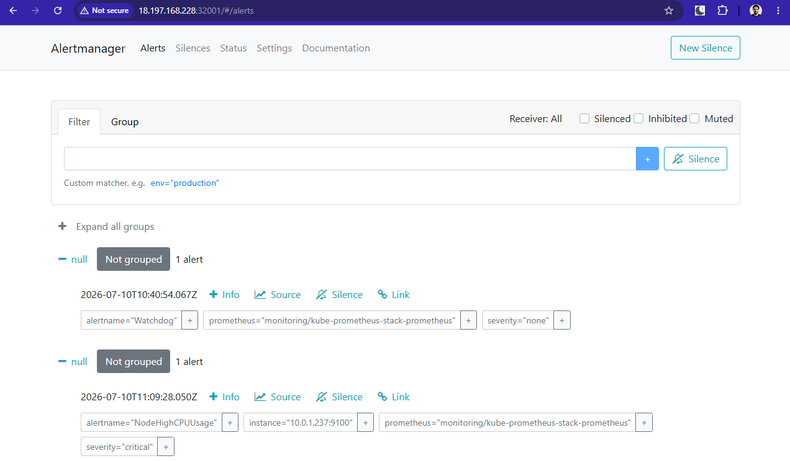

# Home-Task: Automated Kubernetes Infrastructure

This repository contains the complete implementation of a production-grade, secure, and monitored Kubernetes environment deployed on AWS. The infrastructure is fully automated using Terraform and managed via Helm, covering the full lifecycle from cluster bootstrapping to advanced observability.

## Repository Structure
| Phase | Directory | Description |
| :--- | :--- | :--- |
| **01** | `part1-terraform-infrastructure` | Provisioning VPC, EC2 instances, and Security Groups via Terraform. |
| **02** | `part2-bootstrap` | Kubernetes cluster initialization and base configuration. |
| **03** | `part3-networking` | Implementing NetworkPolicies for cross-namespace traffic isolation. |
| **04** | `part4-observability` | Deployment of the monitoring stack (Prometheus + Grafana) with custom alerts. |

---

## 🛠️ Tech Stack
* **Infrastructure:** AWS, Terraform.
* **Orchestration:** Kubernetes.
* **Package Management:** Helm Charts.
* **Observability:** Prometheus, Grafana, Alertmanager.
* **Security:** NetworkPolicies, AWS EC2 Security Groups.

---

## 🚀 Workflow
To reproduce the environment, follow these steps:

1. **Infrastructure:** Navigate to `part1-terraform-infrastructure` and run `terraform apply` to provision network and compute resources.
2. **Cluster:** Perform cluster bootstrapping in `part2-bootstrap`.
3. **Networking:** Apply the NetworkPolicies in `part3-networking` to enforce traffic security and isolation.
4. **Monitoring:** Deploy the Helm stack in `part4-observability` using the provided `values.yaml`.

---

## 📈 Observability & Alerting
Phase 4 implements a custom PrometheusRule (**NodeHighCPUUsage**) that triggers a critical alert when CPU utilization exceeds 50% for over 1 minute.

* **Grafana Dashboard:** Exposed via NodePort `32000` (restricted to authorized IP).
* **Alertmanager:** Exposed via NodePort `32001` (restricted to authorized IP).

## Verification
### **Grafana Alert Status:**

### **Alertmanager Routing:**

---

> **Note:** Each directory contains a dedicated README file with detailed instructions, execution commands, and verification outputs.
